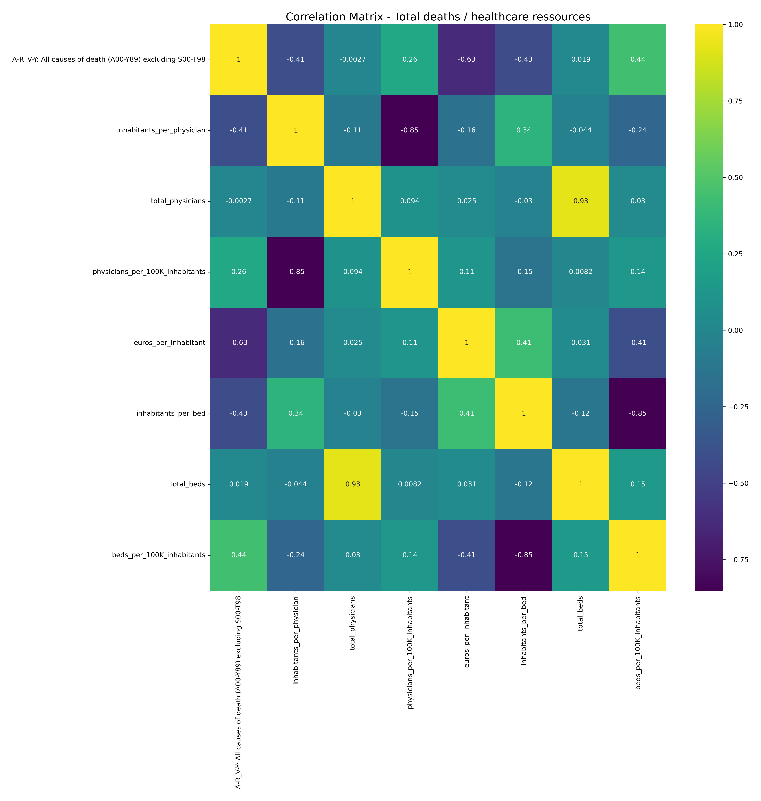
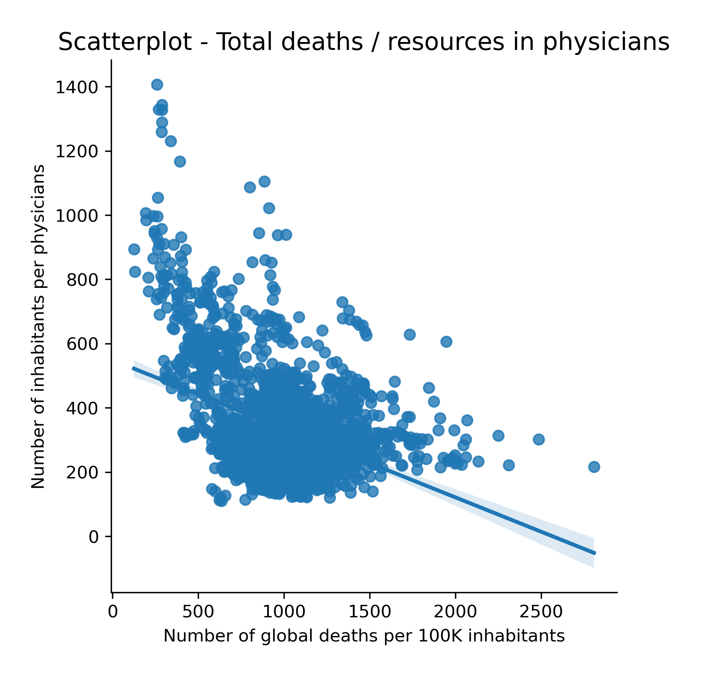
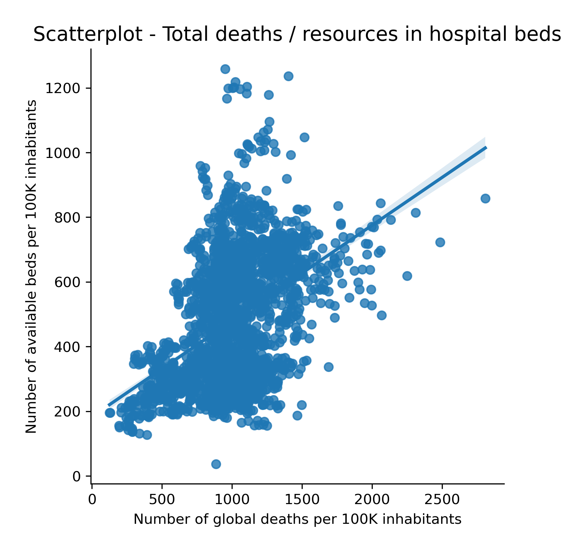
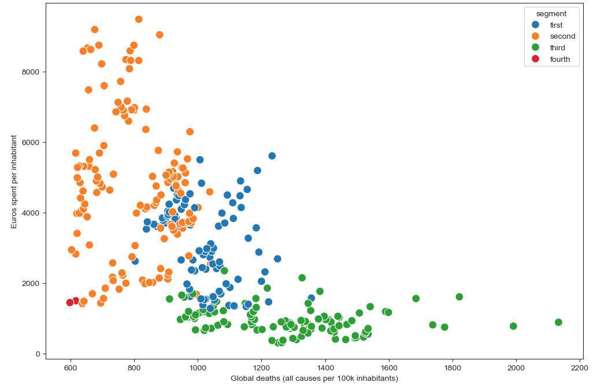
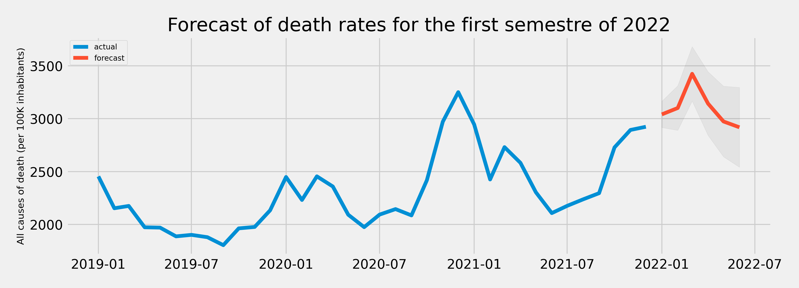

# PYTHON-showcase_Death_vs_Health-Ressources_Europe 

## 1. Context

Europe is a quite heterogenous assembly of countries with there own culture and qualities, but how do they do in death rates comparisons ? And are there any factors helping or hindering healthcare structures ? Animated by these questions, the link between healthcare resources and death rates in all European countries makes for an interesting starting analysis.

By healthcare resources, we aim to focus on money spent by health providers (hospitals mostly), on the number of physicians in each region and on the number of available hospital beds. All causes of deaths are from the death certificates and are surprisingly so many that there are up to 91 referenced death causes.

The Covid 19 pandemic surely couldn't help in delving into a study about death causes in relation to resources, so the timely scope aims at years from 2011 to 2021.

***Is there a link between deaths and healthcare resources?***

## 2. Data set & tools

**- DATA**

All the detailed data sourcing is available in the [following pdf](data/Data_sourcing.pdf).

All external data sets are owned by and from the [Eurostat database collection](https://ec.europa.eu/eurostat/data/database), the statistical office of the European Union whose mission is to provide high-quality statistics and data on Europe. 

From there, I selected and combined the following data sets :
- [Causes of death - crude death rate by NUTS 2 region of residence](https://ec.europa.eu/eurostat/cache/metadata/en/hlth_cdeath_sims.htm) : the  main and more complete data set of the study.
- [Health care expenditure by provider](https://ec.europa.eu/eurostat/cache/metadata/en/hlth_sha11_esms.htm) :  data available on a country level
- [Available beds in hospitals by NUTS 2 region](https://ec.europa.eu/eurostat/cache/metadata/en/hlth_res_esms.htm)
- [Physicians by NUTS2 region](https://ec.europa.eu/eurostat/cache/metadata/en/hlth_res_esms.htm)
- [Self-reported unmet needs for medical examination by main reason declared and NUTS 2 region](https://ec.europa.eu/eurostat/cache/metadata/en/hlth_silc_01_esms.htm)

> [!NOTE]
>An important aspect on these data sets is the common unit of counts per 100K inhabitants, which makes comparisons possible without the need to normalize all counts to the total population.

The Geojson file was downloaded from [Gisco Eurostat official site](https://ec.europa.eu/eurostat/web/gisco/geodata/statistical-units/territorial-units-statistics), using the 2021 version, based on the Coordinate reference system (crs) 4326 and the 20M scale.

*If you are curious to learn more about the NUTS2 regions, I invite you to read this [eurostat github page](https://github.com/eurostat/Nuts2json).*

**- TOOLS**

The main tool used for this inquiry in death and healthcare resources was made in Python using the [Jupyter notebook](https://jupyter.org/) (links to the scripts bellow), with the well known libraries of Pandas, Numpy, etc.
New libraries compared to previous works are [Scikit-learn](https://scikit-learn.org/stable/) for machine learning models, [statsmodels](https://www.statsmodels.org/stable/index.html) for time-series analysis, and [Folium](https://python-visualization.github.io/folium/latest/) for lighter spatial visualizatons than on Plotly.

[TABLEAU Public](https://www.tableau.com/fr-fr/products/public), the well known BI tool, was then used to sum up the study in a simple storyboard (link bellow).

## 3. Analysis (python scripts for each step)

   [**a. Data cleaning:**](scripts/1_Data_cleaning.ipynb) Some of the data was missing and some contained letters (ex: 'e' for estimates) due to incomplete data completion from Eurostat, due to some diverging calculation methods or due to anonymisation (ex: one death count in a small region). Since Eursotat chose no to implement these missing, I tried to play along and kept all null values, at least in the cleaning part. The letters however were deleted from the numerical data points in order to compute said data, allowing for this loss of distinction for estimates.
   
  [**b. Data reshaping and merging:**](scripts/2_Reshaping_merging.ipynb) All the files had the years as variables, making it impossible to merge all the data I wanted to implement in the study, so a reshaping (transposition by melting and pivoting) before the creation of a primary key and then merging was necessary.
  
   [**c. Basic descriptive statitistics (univariate):**](scripts/3_basic_descriptive_statistics.ipynb)  Most variables are right skewed, except for left skewed distribution on the 'No unmet needs to declare' from the survey. Two variables are normal like : physicians and avalible beds per 100K inhabitants. Many variables have outliers, mostly from the fact that the independant variables contain both countries and regions, making the countries values outliers compared to regional values (comparing regions to countries won't make sense).
   
   [**d. Relationship analysis (bivariate):**](scripts/4_Relationship_exploration.ipynb) The relationships explored are mostly health resources to the variables holding the global death counts (all causes included):

   

   In the resources to each other, there is the strongest correlation of the total number of beds to the total number of physicians.
   Most interestingly, related to the death rates, the correlation scores are not very strong and go from the amount of euros spent, the to the number of beds and finalyy to the number of physicians.

   At this point, a first hypothesis on these relationq could be: **If healthcare providers spend more money per inhabitant, then death rates are reduced**
   
   [**e. Spatial analysis:**](scripts/5_Spatial_analysis-light.ipynb) How is this relation shown a map ? The html map made on Folium can be downloaded [here](visuals/Double_choropleth_deaths_euros.html).
   Countries with very low healtcare providers expenditures are the one with the most deaths (all causes) per 100K inhabitants and there is a clear seperation form west and north to east, with more spending and less dying population on the west and north.
   
   **f. Supervised regressions:** Unfortunatly, applying a machine learning model based on regressison wasn't possible on the amounts of euros spent per inhabitant by the healthcare providers, so the study was made on the two following most related healthcare resources of the number of [hospital beds](scripts/6.2_ML_supervised_regression-beds.ipynb) and [physicians](scripts/6.1_ML_supervised_regression-physicians.ipynb) per 100k inhabitants.

    
   
   What the scatter plot is saying : the more physicians there are, the more deaths there are ... Is that so ?
   The higher the number of physicians per 100k inhabitants doesn't equate with more or less deaths (all causes included) in Europe since the model isn't accurate enough with a poor correlation test (R-squared of 0.06).
   
   

   What the scatter plot is saying : the more beds there are, the more deaths there are ... Is that so ?
   As for the physicians, a higher number of beds doesn't equate with more or less deaths (all causes included) in Europe since the model isn't accurate enough with a poor correlation test (R-squared of 0.2).
   
   [**g. Unsupervised clustering:**](scripts/7_ML_unsupervised_clustering-4.ipynb) All 91 causes if deaths were grouped in 12 main components by a PCA and then the K-means clustering was well fitted with 4 clusters. all clusters are only on a statistical level and not on a medical level, making it impossible to interpret them further than that some countries and regions tned to share some similarities in there death causes, with a clear geographical component (shown in Tableau- link below).
   

- As such, without knowing which causes are inside each cluster, we can point out that some death causes are more likely to happen in countries where healthcare providers spend less money per inhabitant !
- Clusters separations are very clear on countries, meaning that the location where people live is very relevant when comparing death causes in Europe.
   
   [**h. Time series analysis:**](scripts/8_time_series_monthly_cod.ipynb) In order to have a final analysis on the time series, a new file was found on eurostat [(link)](https://ec.europa.eu/eurostat/databrowser/product/page/HLTH_CD_MSDR2) account for death rates from 2019 to 2021 included on a monthly basis. Its focus on the COVID 19 period was interesting for trying to create an ARIMA model for forecasting the first semester of 2022, on an univariate analysis. The lack of data on a monthly basis did not allow for a multivariate projection.

  

  The model can't be very accurate for the three reasons : fed with a small data set of only 36 entry points, solely based on the Covid period and not accounting for the previous time period before the pandemic. It is still interesting to notice seasonality on winter.
   
## 4. [Final Tableau storyboard:](https://public.tableau.com/views/Dashboard_analysis/Storyboard?:language=fr-FR&publish=yes&:sid=&:redirect=auth&:display_count=n&:origin=viz_share_link) The stroyboard contains new visuals and interactive maps to check out !

[Bonus visual made in PowerBi desktop](visuals/euros_map.pdf) showing the euros spent by healthcare providers in Europe (choropleth map, KPI and histplot)
